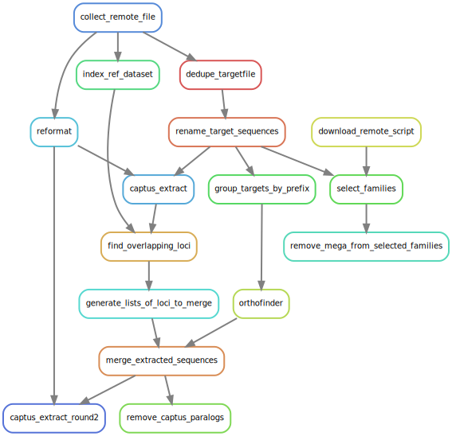

# Queen of Sheba bait design

## Overview

This repository documents the process used to design baits against the draft
Queen of Sheba genome (unreleased at time of writing, 2024-10-10).

The process used these steps:

1. [`captus extract`](https://github.com/edgardomortiz/Captus) was used to find
   "query" targets in "reference" genomes.
    - The **references** used were the Queen of Sheba genome and two
      Platanthera genomes from NCBI,
      [GCA_039513925](https://ftp.ncbi.nlm.nih.gov/genomes/all/GCA/039/513/925/GCA_039513925.1_PZIJ_v1.0/GCA_039513925.1_PZIJ_v1.0_genomic.fna.gz")
      and
      [GCA_039583875](https://ftp.ncbi.nlm.nih.gov/genomes/all/GCA/039/583/875/GCA_039583875.1_PGUA_v1.0/GCA_039583875.1_PGUA_v1.0_genomic.fna.gz).
    - The **queries** were the [`mega353` target
      file](https://github.com/chrisjackson-pellicle/NewTargets) and the target
      file constructed by [Peakall *et
      al*.](https://doi.org/10.1111/1755-0998.13327), which was downloaded from
      [Dryad](https://doi.org/10.5061/dryad.z08kprrbj).
2. Loci overlapping mega353 loci were renamed according to the mega353 loci.
3. Unidentified homologs in the query were detected with
   [OrthoFinder](https://github.com/davidemms/OrthoFinder) and renamed
   according to their orthogroup.

## How to run the workflow on your dataset

### 1. Prepare your target files

- deduplicate the target file by running it through `dedupe.sh`:

```bash
dedupe.sh \
  in=output/000_reference/query/mega353.fasta.gz \
  out=deduplicated.fasta \
  ascending=t \
  exact=t \
  fixjunk=t \
  maxedits=0 \
  maxsubs=0 \
  sort=name \
  touppercase=t \
  uniquenames=t
```

- remove any unusual headers from the FASTA file with `reformat.sh`

```bash
reformat.sh \
  in=deduplicated.fasta \
  out=deduplicated_renamed.fasta \
  trimreaddescription=t \
  fixheaders=t \
  fixjunk=t
```

### 2. Prepare your genome

- remove short contigs to reduce run time (**optional**)

```bash
reformat.sh \
  in=genome.fasta.gz \
  minlength=100000 \
  out=genome.100000.fasta
```

### 3. Run captus extract

This step uses your genome as a "sample" and the loci in the target files as
markers. I'm not sure if this is supported use of Captus but it seems to work.

```bash
captus_assembly extract \
  --captus_assemblies_dir 02_assemblies \
  --fastas genome.100000.fasta \
  --out 03_extractions \
  --nuc_refs deduplicated_renamed.fasta
```

The `03_extractions` folder will contain a GFF3 file of hit locations on the
genome, and a file called `NUC_coding_NT.fna` that includes the sequence of the
target locus extracted from the genome.

### 4. Deal with overlapping or orthologous loci (**optional**)

Depending on what you are using your baits for you may need to deal with
redundancy in the input target file. For example, the target files from
[Peakall *et al*.](https://doi.org/10.1111/1755-0998.13327) don't group
sequences into loci and some of the loci target mega353 loci, but aren't named
as such. This is discussed in their
[publication](https://doi.org/10.1111/1755-0998.13327).

#### a. A simple way of grouping sequences into loci is to run them through orthofinder

After Orthofinder, you can rename the sequences by orthogroup. You need to
group targets by species before you do this (see
`src/group_targets_by_prefix.sh`).

```bash
orthofinder \
  -d \
  -M msa \
  -S diamond_ultra_sens \
  -oa \
  -o OrthoFinder \
  -f grouped_targets 
```

The orthofinder directory will contain a file called `Orthogroups.txt`, which
lists target sequences by orthogroup.

#### b. Find overlaps between different sets of targets

This is more complex. My approach uses the `rtracklayer` R package to read the
GFFs from Captus, then uses `GenomicRanges` to convert them into `GRangesList`
objects grouped by Name, then the `findOverlaps` method to find overlapping
loci. See the script `src/find_overlapping_loci.R`.

#### c. Merge loci

Once you have identified orthologous and/or overlapping loci, you can merge
sequences to generate loci. This requires renaming sequences according to the
format `[sequence_id]-[locus]`. See the script
`src/merge_extracted_sequences.py` for an example.

This is my approach:

- sequences are added to mega353 loci if there is an overlap between the hit
and a known mega353 locus
- if there is no overlap, but they have been grouped into an orthogroup, the
orthogroup ID is used as the locus ID
- sequences that didn't overlap mega353 loci and weren't grouped into
  orthogroups are left as-is.

Doing this will make downstream analysis simplier because Captus and Hybpiper
both understand the `[sequence_id]-[locus]` format. For example, Captus will
only extract one sequence per locus, which makes the alignments less complex.

## Workflow


