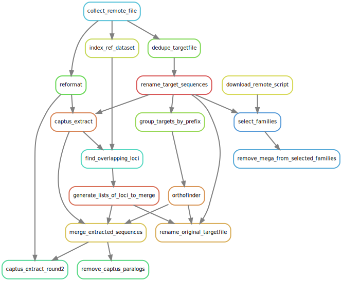

# Queen of Sheba bait design

## Overview

This repository documents the process used to design baits against the draft
Queen of Sheba genome (unreleased at time of writing, 2024-10-10).

The process used these steps:

1. Use [`captus extract`](https://github.com/edgardomortiz/Captus) to map
   "query" targets against "reference" genomes.
    - The **references** used were the Queen of Sheba genome and two
      Platanthera genomes from NCBI,
      [GCA_039513925](https://ftp.ncbi.nlm.nih.gov/genomes/all/GCA/039/513/925/GCA_039513925.1_PZIJ_v1.0/GCA_039513925.1_PZIJ_v1.0_genomic.fna.gz")
      and
      [GCA_039583875](https://ftp.ncbi.nlm.nih.gov/genomes/all/GCA/039/583/875/GCA_039583875.1_PGUA_v1.0/GCA_039583875.1_PGUA_v1.0_genomic.fna.gz).
    - The **queries** were the [`mega353` target file](https://github.com/chrisjackson-pellicle/NewTargets) and the target file constructed by (Peakall *et al*.)[https://doi.org/10.1111/1755-0998.13327], which was downloaded from [Dryad](https://doi.org/10.5061/dryad.z08kprrbj).

## Workflow

